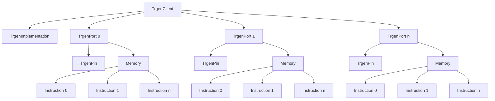

<h1 align="center">TrGEN-Unity</h1>

<!-- GitHub Actions workflow trigger: 2025-10-02 -->

<!-- 
<p align="center">
  

</p>
 -->


[](https://openupm.com/packages/com.cosanlab.trgen/)


A professional Unity library for **Ethernet socket communication** with the **CoSANLab TriggerBox** device. Enables precise trigger control for neuroscience experiments, EEG/fMRI studies, and research applications requiring hardware synchronization.


### Architecture

As explained in this [Mermaid](https://github.com/mermaid-js/mermaid) diagram, we see that we can "attach" n (0-25) TrgenPorts to the `TrgenClient`



```python
client = TrgenClient() # now I can use this client for any purpose.
```

Each `TrgenPort`can be programmed with a bunch of instructions.
We can use the function `SetInstruction()` in many memory slots.
Finally, we can use `SetTrgenMemory` to a specific `TrgenPort` and execute the `TrgenClient` with `client.start()`

#### NOTE
Each TrgenPort can support a list of N instructions, where N = 2^MTML (Max TrgenPort Memory Length)


## 🚀 Features

- **🔌 Ethernet Communication**: Direct TCP/IP connection to TriggerBox hardware
- **⚡ Multiple Trigger Types**: Support for NeuroScan, Synamps, TMS, and GPIO ports
- **🎯 Precision Timing**: Microsecond-level trigger duration control
- **💾 Configuration Management**: Save/load complete trigger setups with memory state
- **📊 Comprehensive Logging**: Detailed debugging and monitoring capabilities
- **🔄 Memory Programming**: Full trigger sequence programming and restoration
- **🛡️ Error Handling**: Robust connection management and error recovery
- **📈 Performance Optimized**: Minimal latency for real-time applications

## 🎯 Use Cases

### Neuroscience Research
- **EEG Experiments**: Precise stimulus marking and event synchronization
- **fMRI Studies**: Scanner trigger coordination and timing control
- **TMS Research**: Transcranial magnetic stimulation trigger management
- **Multi-modal Studies**: Synchronized data acquisition across devices

### Laboratory Applications
- **Behavioral Studies**: Response time measurement and stimulus control
- **Psychophysiology**: Physiological signal synchronization
- **Brain-Computer Interfaces**: Real-time trigger management
- **Clinical Research**: Medical device integration and control

## 📦 Installation

### Option 1: OpenUPM (Recommended)

Install via **OpenUPM CLI**:

```bash
# Install OpenUPM CLI if not already installed
npm install -g openupm-cli

# Install the TrGEN package
openupm add com.cosanlab.trgen
```

### Option 2: Package Manager UI

1. Open **Unity Package Manager** (`Window` → `Package Manager`)
2. Click the **`+`** button and select **`Add package from git URL`**
3. Enter: `https://github.com/stefanolatini/trgen-unity.git`
4. Click **`Add`**

### Option 3: Manual Installation

1. Download the latest release from [GitHub Releases](https://github.com/stefanolatini/trgen-unity/releases)
2. Extract and copy to your project's `Packages` folder
3. Unity will automatically detect and import the package

### Dependencies

- **Unity 2021.3** or newer
- **.NET Standard 2.1** support
- **TCP/IP network access** to TriggerBox device

## 🚀 Quick Start

### Basic Setup

```csharp
using Trgen;
using UnityEngine;

public class TriggerController : MonoBehaviour
{
    private TrgenClient client;

    void Start()
    {
        // Initialize client with TriggerBox IP
        client = new TrgenClient("192.168.123.1", 4242, 2000);
        client.Verbosity = TrgenClient.LogLevel.Info;
        
        // Connect to device
        client.Connect();
        
        if (client.Connected)
        {
            Debug.Log("✅ Connected to TriggerBox!");
        }
    }

    void OnDestroy()
    {
        client?.StopTrigger();
    }
}
```

### Send Simple Triggers

```csharp
public class ExperimentController : MonoBehaviour
{
    [SerializeField] private TrgenClient client;
    
    public void SendStimulusTrigger()
    {
        // Send trigger on NeuroScan port 5
        client.StartTrigger(TrgenPin.NS5);
        Debug.Log("🎯 Stimulus trigger sent!");
    }
    
    public void SendResponseMarker()
    {
        // Send response marker with custom timing
        client.SendMarker(markerNS: 10, stop: true);
        Debug.Log("📝 Response marker sent!");
    }
}
```

### Advanced Configuration

```csharp
public class AdvancedTriggerSetup : MonoBehaviour
{
    private TrgenClient client;
    
    void Start()
    {
        client = new TrgenClient();
        client.Connect();
        
        // Set custom trigger duration
        client.SetDefaultDuration(25); // 25 microseconds
        
        // Program complex trigger sequence
        ProgramComplexSequence();
    }
    
    void ProgramComplexSequence()
    {
        var instructions = new uint[]
        {
            InstructionEncoder.ActiveForUs(50),    // 50µs active
            InstructionEncoder.UnactiveForUs(10),  // 10µs inactive
            InstructionEncoder.ActiveForUs(30),    // 30µs active again
            InstructionEncoder.End()               // End sequence
        };
        
        client.ProgramPortWithInstructions(TrgenPin.NS0, instructions);
        Debug.Log("🔧 Complex sequence programmed!");
    }
}
```

## 📚 Core Components

### TrgenClient
Main interface for TriggerBox communication:

```csharp
var client = new TrgenClient("192.168.123.1", 4242, 2000);
client.Verbosity = TrgenClient.LogLevel.Debug;
client.Connect();

// Basic operations
client.StartTrigger(TrgenPin.NS5);
client.SendMarker(markerNS: 255, stop: true);
client.SetDefaultDuration(40);
client.StopTrigger();
```

### TriggerPin Constants
Predefined pin identifiers for all ports:

```csharp
// NeuroScan pins (NS0-NS7)
TrgenPin.NS0, TrgenPin.NS1, ..., TrgenPin.NS7

// Synamps pins (SA0-SA7) 
TrgenPin.SA0, TrgenPin.SA1, ..., TrgenPin.SA7

// TMS pins
TrgenPin.TMSO, TrgenPin.TMSI

// GPIO pins (GPIO0-GPIO7)
TrgenPin.GPIO0, TrgenPin.GPIO1, ..., TrgenPin.GPIO7

// Collections for batch operations
TrgenPin.AllNs, TrgenPin.AllSa, TrgenPin.AllGpio, TrgenPin.AllTMS
```

### Configuration Management
Save and restore complete trigger setups:

```csharp
// Export current configuration
string savedPath = client.ExportConfiguration(
    "Configurations/EEG_Experiment",
    projectName: "Visual P300 Study",
    description: "Configuration for oddball paradigm",
    author: "Dr. Smith"
);

// Import configuration
var config = client.ImportConfiguration("Configurations/EEG_Experiment.trgen");

// Create custom configurations
var customConfig = new TrgenConfiguration();
customConfig.Defaults.DefaultTriggerDurationUs = 15;
// ... configure ports
TrgenConfigurationManager.SaveConfiguration(customConfig, "Custom_Setup");
```

## 🔧 Advanced Examples

### Multi-Port Synchronized Triggers

```csharp
public void SendSynchronizedMarkers()
{
    // Reset all ports first
    client.ResetAll(TrgenPin.AllNs);
    client.ResetAll(TrgenPin.AllGpio);
    
    // Program multiple ports
    var targetPorts = new List<int> { 
        TrgenPin.NS0, TrgenPin.NS1, TrgenPin.GPIO0 
    };
    
    client.StartTriggerList(targetPorts);
    Debug.Log("🎯 Synchronized multi-port trigger sent!");
}
```

### Conditional Trigger Logic

```csharp
public class ConditionalTriggers : MonoBehaviour
{
    private TrgenClient client;
    private bool isTargetTrial = false;
    
    public void SendConditionalTrigger()
    {
        if (isTargetTrial)
        {
            // Target stimulus - short, precise trigger
            client.SendMarker(markerNS: 1, stop: true);
            Debug.Log("🎯 Target trigger: NS1");
        }
        else
        {
            // Distractor stimulus - different marker
            client.SendMarker(markerNS: 2, stop: true);
            Debug.Log("🔄 Distractor trigger: NS2");
        }
    }
}
```

### Performance Monitoring

```csharp
public class TriggerPerformanceTest : MonoBehaviour
{
    private TrgenClient client;
    
    public void TestTriggerLatency()
    {
        var stopwatch = System.Diagnostics.Stopwatch.StartNew();
        
        // Test different durations
        for (uint duration = 5; duration <= 50; duration += 5)
        {
            client.SetDefaultDuration(duration);
            
            var iterationWatch = System.Diagnostics.Stopwatch.StartNew();
            client.StartTrigger(TrgenPin.NS5);
            iterationWatch.Stop();
            
            Debug.Log($"⏱️ Duration: {duration}µs - Latency: {iterationWatch.ElapsedMilliseconds}ms");
        }
        
        stopwatch.Stop();
        Debug.Log($"📊 Total test time: {stopwatch.ElapsedMilliseconds}ms");
    }
}
```

### Configuration Templates

```csharp
public static class TriggerTemplates
{
    public static TrgenConfiguration CreateEEGTemplate()
    {
        var config = new TrgenConfiguration();
        config.Metadata.ProjectName = "EEG Standard Template";
        config.Defaults.DefaultTriggerDurationUs = 10; // Optimal for EEG
        
        // Configure specific ports for EEG
        config.TriggerPorts["NS0"] = new TriggerPortConfig
        {
            Id = 0,
            Name = "Target Stimulus",
            Enabled = true,
            CustomDurationUs = 10,
            Notes = "Target stimuli for P300 paradigm"
        };
        
        config.TriggerPorts["NS1"] = new TriggerPortConfig
        {
            Id = 1,
            Name = "Standard Stimulus", 
            Enabled = true,
            CustomDurationUs = 10,
            Notes = "Standard stimuli for P300 paradigm"
        };
        
        return config;
    }
    
    public static TrgenConfiguration CreatefMRITemplate()
    {
        var config = new TrgenConfiguration();
        config.Metadata.ProjectName = "fMRI Standard Template";
        config.Defaults.DefaultTriggerDurationUs = 100; // Longer for fMRI
        
        // Configure for scanner synchronization
        config.TriggerPorts["GPIO0"] = new TriggerPortConfig
        {
            Id = 18,
            Name = "Scanner Sync",
            Enabled = true,
            CustomDurationUs = 200,
            Notes = "Scanner trigger synchronization"
        };
        
        return config;
    }
}
```

## 📋 Trigger Port Reference

| Port Type | Range | IDs | Description |
|-----------|-------|-----|-------------|
| **NeuroScan** | NS0-NS7 | 0-7 | EEG amplifier triggers |
| **Synamps** | SA0-SA7 | 8-15 | Synamps amplifier triggers |
| **TMS** | TMSO, TMSI | 16-17 | Transcranial magnetic stimulation |
| **GPIO** | GPIO0-GPIO7 | 18-25 | General purpose I/O |

## ⚙️ Configuration File Format

Configuration files use the `.trgen` extension and JSON format:

```json
{
  "metadata": {
    "version": "1.0",
    "projectName": "EEG Experiment",
    "author": "Dr. Smith",
    "description": "P300 oddball paradigm setup",
    "createdAt": "2024-10-02T15:30:00"
  },
  "defaults": {
    "defaultTriggerDurationUs": 15,
    "defaultLogLevel": "Warn",
    "autoResetEnabled": true
  },
  "triggerPorts": {
    "NS0": {
      "id": 0,
      "name": "Target Stimulus",
      "type": "NS",
      "enabled": true,
      "memoryInstructions": [67108873, 196611, 0, ...],
      "programmingState": "Programmed"
    }
  },
  "network": {
    "ipAddress": "192.168.123.1",
    "port": 4242,
    "timeoutMs": 2000
  }
}
```

## 🔧 Troubleshooting

### Common Issues

**Connection Failed**
```csharp
if (!client.Connected)
{
    Debug.LogError("❌ Connection failed. Check:");
    Debug.LogError("  • TriggerBox IP address (default: 192.168.123.1)");
    Debug.LogError("  • Network connectivity");
    Debug.LogError("  • Firewall settings");
    Debug.LogError("  • Device power status");
}
```

**Trigger Not Firing**
```csharp
// Verify port programming
var memory = client.GetPortMemory(TrgenPin.NS5);
if (memory.All(instruction => instruction == 0))
{
    Debug.LogWarning("⚠️ Port NS5 not programmed. Programming default trigger...");
    client.ProgramDefaultTrigger(client.CreateTrgenPort(TrgenPin.NS5));
}
```

**Performance Issues**
```csharp
// Optimize for high-frequency triggers
client.Verbosity = TrgenClient.LogLevel.Error; // Reduce logging
client.SetDefaultDuration(5); // Minimum duration for faster triggers
```

### Debug Tools

```csharp
// Memory snapshot for debugging
var snapshot = client.CreateMemorySnapshot();
foreach (var port in snapshot)
{
    var instructions = port.Value.Count(i => i != 0);
    if (instructions > 0)
    {
        Debug.Log($"🔍 {port.Key}: {instructions} instructions programmed");
    }
}

// Network connectivity test
if (client.IsAvailable())
{
    Debug.Log("✅ TriggerBox is reachable");
}
else
{
    Debug.LogError("❌ TriggerBox not reachable - check network");
}
```

## 🧪 Testing

### Unit Tests
```bash
# Run tests in Unity Test Runner
# Window → General → Test Runner
```

### Integration Tests
```csharp
[Test]
public void TestTriggerSequence()
{
    var client = new TrgenClient();
    client.Connect();
    
    Assert.IsTrue(client.Connected, "Should connect to TriggerBox");
    
    client.StartTrigger(TrgenPin.NS5);
    // Verify trigger was sent
    
    client.StopTrigger();
}
```

## 🤝 Contributing

1. **Fork** the repository
2. **Create** a feature branch (`git checkout -b feature/amazing-feature`)
3. **Commit** your changes (`git commit -m 'Add amazing feature'`)
4. **Push** to the branch (`git push origin feature/amazing-feature`)
5. **Open** a Pull Request

### Development Setup

```bash
# Clone repository
git clone https://github.com/stefanolatini/trgen-unity.git

# Open in Unity 2021.3+
# Install development dependencies via Package Manager
```

## 📄 License

This project is licensed under the **MIT License** - see the [LICENSE](LICENSE) file for details.

## 🏛️ About CoSANLab

**Cognitive and Social Action Lab (CoSANLab)**  
Sapienza University of Rome  
[Website](https://research.uniroma1.it/laboratorio/144782) | [GitHub](https://github.com/CoSANLabRome)

## 📞 Support

- **🐛 Issues**: [GitHub Issues](https://github.com/stefanolatini/trgen-unity.git/issues)
- **💬 Discussions**: [GitHub Discussions](https://github.com/stefanolatini/trgen-unity.git/discussions)
- **📧 Email**: 
  - federico.rossano@iit.it
  - stefanoelatini@hotmail.it

## 🙏 Acknowledgments

- **CoSANLab Team** - Original development and research
- **Unity Community** - Feedback and testing
- **Neuroscience Researchers** - Use cases and requirements

---
