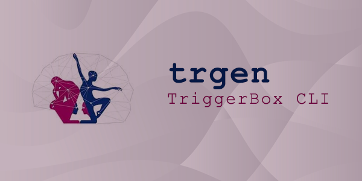

<h1 align="center">TRGen Unity Package</h1>

<p align="center">
  
</p>

<h3 align="center">Una libreria Unity per la comunicazione Ethernet con il dispositivo CoSANLab TriggerBox</h3>

<p align="center">
  <a href="https://unity.com"></a>
  <a href="https://github.com/stefanolatini/trgen-unity/releases"></a>
  <a href="https://opensource.org/licenses/MIT"></a>
  <a href="https://openupm.com/packages/com.cosanlab.trgen/"></a>
</p>

---

## ✨ Caratteristiche

- 🔌 **Supporto completo per tutti i tipi di pin**: NeuroScan, Synamps, GPIO, TMS
- ⚡ **Operazioni sincrone e asincrone** per massima flessibilità  
- 🎯 **Trigger di precisione** con controllo temporale in microsecondi
- 📡 **Connessione TCP/IP persistente** con gestione automatica degli errori
- 🔄 **Thread-safe** per applicazioni multi-thread
- 📝 **Sistema di logging configurabile** per debug e diagnostica
- 🧩 **Programmazione avanzata** con sequenze, loop e sincronizzazione

## 📦 Installazione

### Metodo 1: OpenUPM (Consigliato)

```bash
openupm add com.cosanlab.trgen
```

### Metodo 2: Package Manager Unity

1. Apri **Window > Package Manager**
2. Clicca **"+"** → **"Add package from git URL..."**  
3. Inserisci: `https://github.com/stefanolatini/trgen-unity.git`

### Metodo 3: Manifest Manuale

Aggiungi al tuo `Packages/manifest.json`:

```json
{
  "dependencies": {
    "com.cosanlab.trgen": "1.0.0"
  },
  "scopedRegistries": [
    {
      "name": "OpenUPM", 
      "url": "https://package.openupm.com",
      "scopes": ["com.cosanlab.trgen"]
    }
  ]
}
```

## 🚀 Guida Rapida

### Connessione Base


```csharp
using Trgen;
using UnityEngine;

public class BasicTriggerExample : MonoBehaviour
{
    private TrgenClient client;
    
    async void Start()
    {
        // Crea client con IP di default (192.168.123.1:4242)
        client = new TrgenClient();
        client.Verbosity = LogLevel.Info; // Log opzionale
        
        try
        {
            await client.ConnectAsync();
            Debug.Log("TriggerBox connesso!");
        }
        catch (System.Exception ex)
        {
            Debug.LogError($"Connessione fallita: {ex.Message}");
        }
    }
    
    void OnDestroy()
    {
        client?.Disconnect(); // Sempre disconnettere
    }
}
```

### Invio Trigger Singolo

```csharp
// Trigger singolo su pin NeuroScan 5 (impulso 20μs)
client.StartTrigger(TriggerPin.NS5);
```

### Invio Marker Codificati

```csharp
// Invia valore 5 sui pin NeuroScan (attiva NS0 e NS2)
client.SendMarker(markerNS: 5);

// Invio simultaneo su più porte
client.SendMarker(
    markerNS: 3,     // NeuroScan: valore 3  
    markerGPIO: 7,   // GPIO: valore 7
    LSB: true        // LSB first
);
```

### Esempio Avanzato: Sequenza Personalizzata

```csharp
// Crea trigger personalizzato
var trigger = client.CreateTrgenPort(TriggerPin.NS5);

// Programma sequenza: attivo 50μs, inattivo 10μs, fine
trigger.SetInstruction(0, InstructionEncoder.ActiveForUs(50));
trigger.SetInstruction(1, InstructionEncoder.UnactiveForUs(10));
trigger.SetInstruction(2, InstructionEncoder.End());

// Invia al dispositivo ed esegui
client.SendTrgenMemory(trigger);
client.Start();
```

## 📚 Documentazione Completa

Per documentazione dettagliata, esempi avanzati e API reference:

**👉 [Leggi la Documentazione Completa](Documentation/trgen-unity.md)**

### Sommario Rapido

- **[Caratteristiche dettagliate](Documentation/trgen-unity.md#-caratteristiche)**
- **[Guida all'installazione](Documentation/trgen-unity.md#-installazione)**  
- **[Documentazione API completa](Documentation/trgen-unity.md#-documentazione-api)**
- **[Esempi pratici](Documentation/trgen-unity.md#-esempi-avanzati)**
- **[Risoluzione problemi](Documentation/trgen-unity.md#-risoluzione-problemi)**

## 🎯 Tipi di Pin Supportati

| Tipo | Pin | Descrizione | Utilizzo Tipico |
|------|-----|-------------|-----------------|
| **NeuroScan** | NS0-NS7 | Amplificatori NeuroScan | EEG, MEG, trigger di sincronizzazione |
| **Synamps** | SA0-SA7 | Amplificatori Synamps | EEG ad alta densità, ricerca |  
| **GPIO** | GPIO0-GPIO7 | Pin generici programmabili | Controllo dispositivi esterni |
| **TMS** | TMSO, TMSI | Stimolazione magnetica | TMS, controllo stimolatori |

## ⚡ Esempi d'Uso Rapidi

### Esperimento EEG

```csharp
// Marker di inizio trial
client.SendMarker(markerNS: trialNumber);

// Presenta stimolo e invia trigger
client.StartTrigger(TriggerPin.NS1);
ShowStimulus();

// Marker di risposta utente  
client.SendMarker(markerNS: responseCode);
```

### Controllo Stimolatore TMS

```csharp
// Attiva stimolatore tramite GPIO
client.StartTrigger(TriggerPin.GPIO0);

// Trigger di sincronizzazione su TMS
client.StartTrigger(TriggerPin.TMSO);
```

### Sincronizzazione Multi-dispositivo

```csharp
// Trigger simultaneo su più sistemi
client.StartTriggerList(new List<int> {
    TriggerPin.NS0,    // EEG
    TriggerPin.GPIO3,  // Eye-tracker  
    TriggerPin.SA5     // fMRI
});
```

## 🔧 Requisiti Sistema

- **Unity:** 2021.3 o superiore
- **Framework:** .NET Standard 2.1
- **Piattaforme:** Windows, macOS, Linux
- **TriggerBox:** Dispositivo CoSANLab con firmware compatibile
- **Rete:** Connessione Ethernet TCP/IP

## 🤝 Contribuire

I contributi sono benvenuti! Per contribuire:

1. Fork del repository
2. Crea branch feature (`git checkout -b feature/AmazingFeature`)
3. Commit modifiche (`git commit -m 'Add AmazingFeature'`)
4. Push branch (`git push origin feature/AmazingFeature`)  
5. Apri Pull Request

## 📄 Licenza

Distribuito sotto licenza MIT. Vedi `LICENSE` per dettagli.

## 📞 Supporto & Contatti

- **🐛 Issues:** [GitHub Issues](https://github.com/stefanolatini/trgen-unity/issues)
- **📧 Email:** stefanoelatini@hotmail.it  
- **🏛️ Lab:** [CoSANLab Roma](https://research.uniroma1.it/laboratorio/144782)
- **📚 Docs:** [Documentazione Completa](Documentation/trgen-unity.md)

---

<div align="center">

**Sviluppato con ❤️ da [CoSANLab - Università di Roma La Sapienza](https://research.uniroma1.it/laboratorio/144782)**

*Per ricerca in neuroscienze cognitive e applicazioni di stimolazione cerebrale*

</div>
